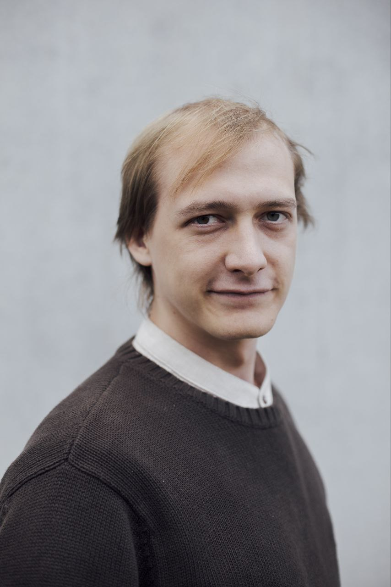

 

$${\color{white}Welcome,\space my\space name\space is\space \color{lightblue}Ivan \space \color{blue} Ogloblin}$$

<ul style="
  color:#ffffff;
  font-size:15px;
  line-height:1.6;
  list-style-position: inside;
  padding-left: 0;
  margin-left: 0;
">
  <li><strong>Middle Software Engineer</strong> with a strong entrepreneurial background and 5 years of experience.</li>
  <li><strong>Former Founding Engineer</strong> of a profitable AI platform scaled to 200,000+ users.</li>
  <li>Specialized in <strong>C++/Python integration</strong>, achieving 10,000× gains.</li>
  <li>Proven ability to take systems from prototype to production.</li>
</ul>

<strong>📍 Location:</strong> Blaustein, Germany 
<strong>🧠 Interests:</strong> AI, Quantum Computing, Game Development 
<strong>💻 Core Languages:</strong> C++, Python, C#, TypeScript 
<strong>💬 Telegram:</strong> @old_Cheech

